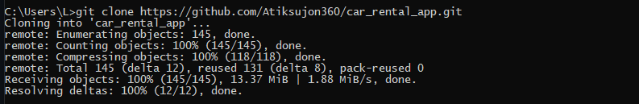
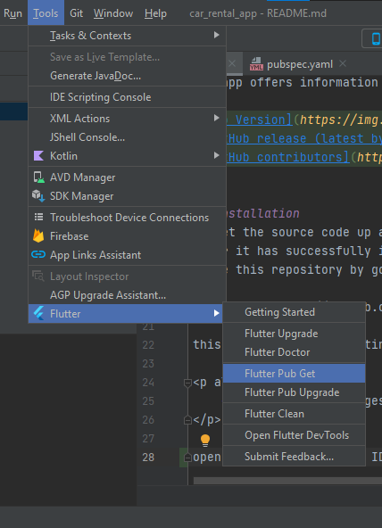
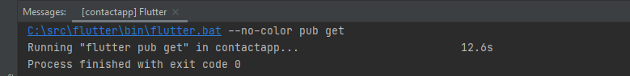
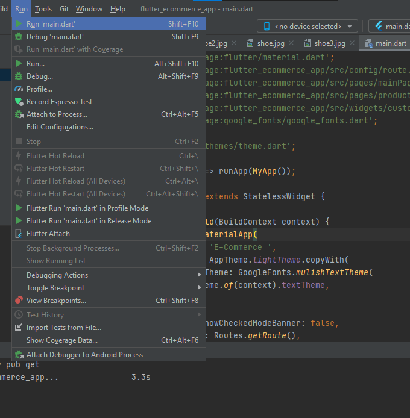
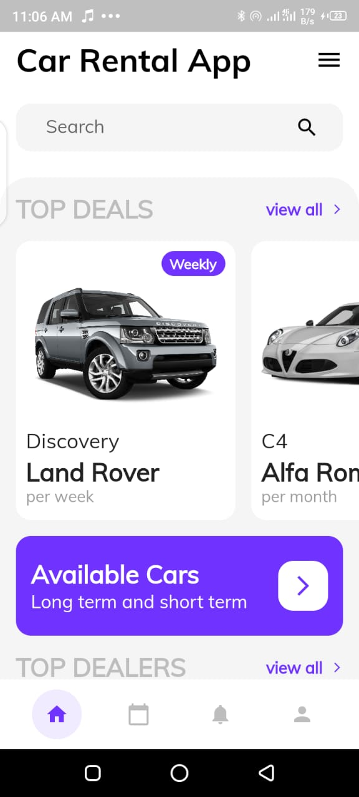
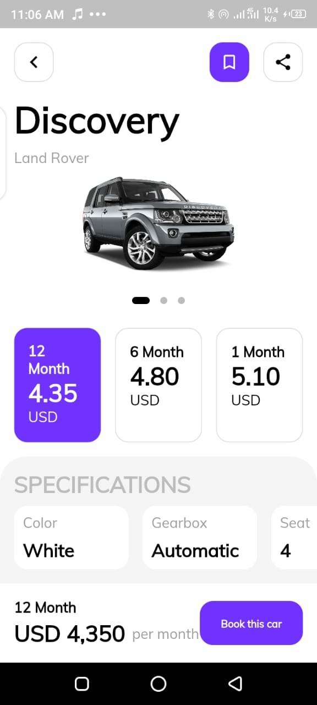
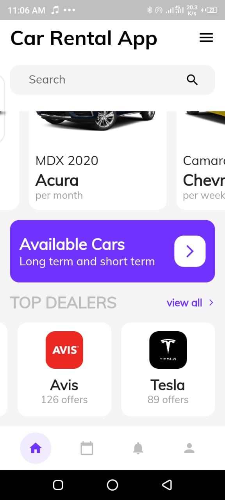

    

## Project Overview
This project achieved the aim and objective of creating a car rental app using flutter. The app has a beautiful User interface to ease user interactivity, high quality images to show what cars are available for hire. The project waS built using most recent packages to avoid quick future deprecation of any package.
The app offers information such as the type of gear box(Automatic or manual), Engine type(V6 or V4), color, and number of seat, thereby giving the user a wide range of options to pick from. The app is easy to use and understand its process flow.

## Installation
To get the source code up and running on your computer, you need to first install an IDE, preferably [Android Studio](https://developer.android.com/studio?gclid=Cj0KCQiAmKiQBhClARIsAKtSj-mCE3Dc0T4FuVNp5WzCsOKbAIlaTP-7DuCYL-p5D8PZbAPgfU6IizEaAuYyEALw_wcB&gclsrc=aw.ds), follow instructions that pop up while installing Android studio.
After it has successfully installed, install the flutter plugin and download Dart SDK, instructions on how to do that can be found [here](https://flutter.dev/?gclid=Cj0KCQiAmKiQBhClARIsAKtSj-lDkI-zjlymTZot1n0GglKPrghu2aqO_4cwNH_bZUuLGbCyh_Dwun0aAqgDEALw_wcB&gclsrc=aw.ds). when that is done,
clone this repository by going to your git terminal and running the command below

*git clone https://github.com/VershimaKelvin/car_rental_app.git*

this should be the resulting display after the repository has been cloned successfully

    

open the project in your IDE and run flutter pug get in the terminal or from the tools menu

    

this should be the resulting screen after a successful pubrun

    

The Project is now ready to be tested on a real device or Emulator, to run app, locate run on the menu bar and select run'main.dart' 

    

## ScreenShots
Here are Screenshoots taken from an android device
     home page             | Single Car information page | Top dealers page
:-------------------------:|:-------------------------:|:-------------------------:

|  | 
